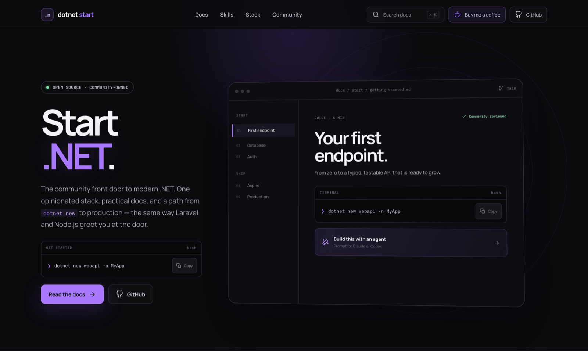

# .NET Start

**.NET starts here.** The community-driven front door to modern .NET: opinionated
documentation, runnable examples, prompts for coding agents, and installable .NET skills.

[](https://dotnet-start.onrender.com)

**[Open the site →](https://dotnet-start.onrender.com)**

---

## 📝 Contribute to the docs

**This is the part that matters.** Every page on the site is a Markdown file in
[`docs/`](docs/) — there is no CMS, no database, and no component to edit.
**Adding a file publishes a page.** No C# knowledge required.

```bash
docs/start/my-guide.md   ->   /docs/start/my-guide
```

Three steps:

1. **Fork it**, and add or edit a `.md` file under `docs/<section>/`.
2. **Start it with front matter** — `title`, `description`, and an `order`:
   ```markdown
   ---
   title: Short page title
   description: One sentence describing what the page covers.
   order: 30
   ---
   ```
3. **Open a pull request** saying what became clearer.

> **📖 Read [docs/README.md](docs/README.md) first.** It is the full reference:
> section layout, front matter, heading anchors, how search ranks a page, local
> preview, and a checklist to run before opening the pull request.

Typos, clearer examples, better defaults, and missing steps all count. Small
improvements are the ones that add up.

---

## Run locally

Requires the .NET 10 SDK.

```bash
dotnet restore
dotnet run --project dotnet-start.csproj
```

The UI is a Blazor Web App with interactive server components. Its main routes are `/`, `/docs`, and `/skills`.

## How the documentation works

Every page under `/docs` is a Markdown file in `docs/`. Nothing about a page is hardcoded in a component: add a file, and the site publishes it.

```
docs/
  <section>/_section.md     # section title, description, and order in the sidebar
  <section>/<page>.md       # one documentation page → /docs/<section>/<page>
```

Each file starts with front matter:

```markdown
---
title: Minimal APIs
description: The endpoint model — parameter binding, results, groups, and filters.
order: 20
---
```

`title` and `description` drive the sidebar, the index cards, and search. `order` sorts the page inside its section (lower first). The `## ` headings become the "on this page" rail, and the "Edit this page" link points at the file on GitHub.

Current sections: `start`, `csharp`, `runtime`, `web`, `data`, `ui`, `testing`, `ops`, `architecture`, `reference`.

The rules above are summarised here; [docs/README.md](docs/README.md) is the
authoritative version and explains the edge cases.

## Content belongs to the community

Documentation lives in `docs/` as Markdown. Every guide should include a useful Claude/Codex prompt as well as commands a human can run directly.

Installable skills live in `skills/`:

| Skill | Covers |
| --- | --- |
| `csharp` | The language: nullability, records, pattern matching, LINQ, exceptions |
| `aspnet-core` | Minimal APIs, controllers, DI, validation, auth, problem details |
| `blazor` | Render modes, components, forms, accessibility, interop |
| `ef-core` | Modeling, queries, migrations, transactions, concurrency |
| `dotnet-async` | Async correctness, cancellation, concurrency, background services |
| `dotnet-testing` | Test design, fakes, `WebApplicationFactory`, Testcontainers |
| `dotnet-observability` | Structured logging, OpenTelemetry, health checks, resilience |
| `dotnet-performance` | Benchmarking, allocations, caching, Native AOT |

Install one with `npx skills add JcscJosecarlossilvacoelho/dotnet-start --skill <name>`, or all of them by dropping the flag.

## Deployment

This is a Blazor **Server** app: it holds a SignalR circuit per visitor and reads
`docs/*.md` from disk at runtime. It needs a long-lived ASP.NET Core process, so
static hosts such as GitHub Pages cannot serve it.

`.github/workflows/deploy.yml` builds the container and pushes it to GitHub
Container Registry on every push to `main`:

```
ghcr.io/<owner>/dotnet-start:latest
```

That image runs anywhere that takes a container — Fly.io, Azure Container Apps,
Render, Cloud Run, or a plain VPS:

```bash
docker run -p 8080:8080 ghcr.io/<owner>/dotnet-start:latest
```

### Render

`render.yaml` is a working blueprint. Three things matter for this app:

- **Bind to `$PORT`.** Render injects it (10000 by default) and scans for it;
  a container that hardcodes 8080 fails with `Port scan timeout reached`.
  `Program.cs` picks it up automatically.
- **Health check `/healthz`.** Set it on the service, or let the blueprint do it.
- **Do not force HTTPS in the container.** Render terminates TLS at its edge and
  forwards plain HTTP, so `UseHttpsRedirection` has no port to redirect to. The
  app detects this and trusts `X-Forwarded-Proto` instead — which is also what
  lets the Blazor circuit negotiate `wss://` rather than `ws://`.

Render's free instances spin down when idle. That drops the SignalR circuit of
anyone reading, so use a paid instance for anything public.

### Fly.io

`fly.toml` is ready to go. Pick a unique app name, then:

```bash
fly launch --no-deploy --copy-config
gh secret set FLY_API_TOKEN --body "$(fly tokens create deploy)"
```

Once the secret exists, the `fly` job in the deploy workflow stops skipping and
every push to `main` ships. `min_machines_running = 1` is deliberate — a suspended
machine drops the SignalR circuits of anyone currently reading.

Read [CONTRIBUTING.md](CONTRIBUTING.md) before opening a pull request.
